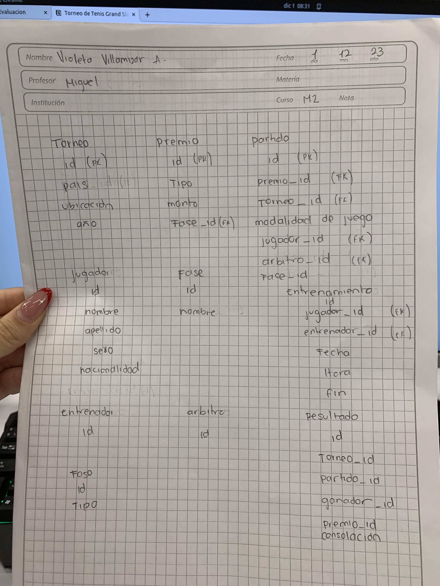
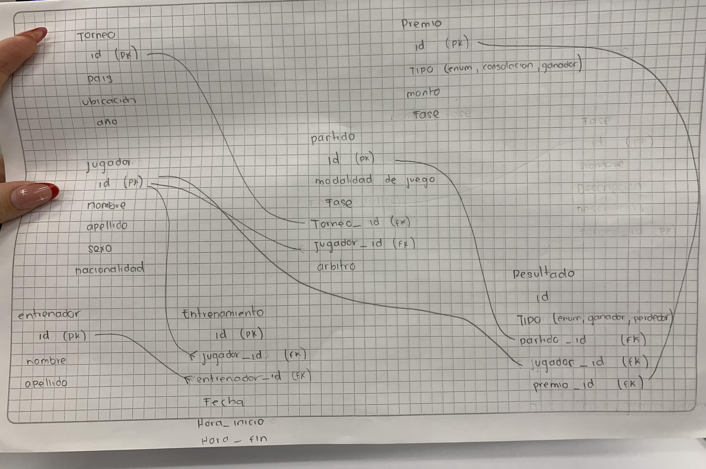

# Tenis Grand Slam

## Nombre bd cluster : 'grandSlam'

> El sistema debe almacenar de manera integral la información de todos los encuentros que han tenido lugar desde el inicio del torneo, incluyendo diversas características asociadas. En el contexto del Grand Slam, que consta de cuatro torneos anuales celebrados en Gran Bretaña, Estados Unidos, Francia y Australia, es importante considerar que cada país puede albergar el torneo en diferentes ubicaciones, como Forest Hill o Flashing Meadows en EE. UU.

Cada partido está vinculado a un premio de consolación para el perdedor, cuyo monto depende de la fase del torneo en la que se encuentre (por ejemplo, el perdedor de octavos de final puede recibir 5,000 dólares). El ganador de la final, por su parte, obtendrá el premio correspondiente al torneo. Además, se deben contemplar cinco modalidades de juego en cada torneo: Individual masculino, individual femenino, dobles masculino, dobles femenino y dobles mixtos.

Es esencial tener en cuenta la nacionalidad de los jugadores, ya que estos pueden ser apátridas o tener múltiples nacionalidades.


> Modelo Lógico

## Identificacion de entidades y atributos




1. **jugador**

- id (PK)
- nombre (varchar 50)
- apellido (varchar 50)
- sexo (varchar 20)
- nacionalidad (varchar 50)

2. **torneo**

- id (PK)
- pais (varchar 50)
- ubicacion (varchar 100)
- año (year)

3. **partido**

- id (PK)
- modalidad de juego (varchar 100)
- fase (varchar 100)
- torneo_id (FK)
- jugador_id (FK)
- arbitro (varchar 50)

4. **resultado**

- id (PK)
- tipo (enum ganador, perdedor)
- partido_id (FK)
- jugador_id (FK)
- premio_id (FK)

5. **premio**

- id (PK)
- tipo (enum consolacion, copa)
- monto (INT)
- fase (varchar 100)

6. **entrenamiento**

- id (PK)
- jugador_id (FK)
- entrenador_id (FK)
- fecha (date)
- hora inicio (time)
- hora fin (time)

7. **entrenador**

- id (PK)
- nombre (varchar 50)
- apellido (varchar 50)


> Modelo Físico



# QUERIES

Consultas


1. Dado un año y un torneo, composición y resultado de los partidos.

    ```sql
      DELIMITER $$
      CREATE PROCEDURE resultadosSegunTorneoYAño(IN año_torneo YEAR, IN id_torneo INT)
      BEGIN
        SELECT p.*, r.*
        FROM resultado r
        JOIN partido p ON r.partido_id = p.id
        JOIN torneo t ON p.torneo_id = t.id
        WHERE t.año= año_torneo AND t.id=id_torneo;
      END $$
      DELIMITER ;

      CALL resultadosSegunTorneoYAño(1987, 21);
    ```

2. Lista de árbitros que participaron en el torneo.

    ```sql
        -- inserta como parametro el id del torneo
      DELIMITER $$
      CREATE PROCEDURE arbitroParticipaTorneo(IN id_torneo INT)
      BEGIN
        SELECT DISTINCT arbitro
        FROM partido
        WHERE torneo_id=id_torneo;
      END $$
      DELIMITER ;

      CALL arbitroParticipaTorneo(4);
    ```

3. Ganancias percibidas en premios por un jugador a lo largo del torneo.

    ```sql
      DELIMITER $$
      CREATE PROCEDURE ganaciasTotalesJugador(IN jugador_id INT)
      BEGIN
        SELECT j.nombre, SUM(p.monto) AS ganancias
        FROM resultado r
        JOIN premio p ON r.premio_id = p.id
        JOIN jugador j ON r.jugador_id = j.id
        WHERE j.id = jugador_id;
      END $$
      DELIMITER ;

      CALL ganaciasTotalesJugador(4);
    ```

4. Lista de entrenadores que han entrenado a un jugador a lo largo del torneo y fechas en las que lo hizo.

    ```sql
        -- entrenamientos de todos los jugadores
      SELECT e.nombre AS nombre_entrenador, j.nombre AS nombre_jugador, ent.fecha AS fecha_entrenamiento
      FROM entrenamiento ent
      JOIN entrenador e ON ent.entrenador_id = e.id
      JOIN jugador j ON ent.jugador_id = j.id;

        -- entrenamientos a un jugador especifico
        DELIMITER $$
      CREATE PROCEDURE entrenamientosJugador(IN id_jugador_especifico INT)
      BEGIN
        SELECT e.nombre AS nombre_entrenador, j.nombre AS nombre_jugador, ent.fecha AS fecha_entrenamiento
        FROM entrenamiento ent
        JOIN entrenador e ON ent.entrenador_id = e.id
        JOIN jugador j ON ent.jugador_id = j.id
        WHERE j.id=id_jugador_especifico;
      END $$
      DELIMITER ;

      CALL entrenamientosJugador(2);
    ```

5. Connors gano Gerulaitis en Roland Garros en 1979 en cuartos de final en individuales masculinos por 6-3 4-6/7-5 6-0.

    ```sql
      SELECT r.*, p.*, j.nombre, j.apellido, t.año
      FROM resultado r
      JOIN partido p ON r.partido_id = p.id
      JOIN jugador j ON p.jugador_id = j.id
      JOIN torneo t ON p.torneo_id = t.id
      WHERE j.apellido='connors';
    ```

6. El señor Wilkinson arbitro ese partido.

    ```sql
        DELIMITER $$
        CREATE PROCEDURE partidosDelSeñorWilkinson()
        BEGIN
        SELECT *
        FROM partido
        WHERE arbitro ='Wilkinson';
        END $$
        DELIMITER ;

        CALL partidosDelSeñorWilkinson();
    ```

7. Alemania ha ganado dos veces las individuales masculinas de Wimbledon. Borg ha ganado 2.000.000 de dólares a lo largo de su participación en el Grand Slam.

    ```sql
      SELECT r.*, j.nacionalidad, p.modalidad_de_juego
      FROM resultado r
      JOIN jugador j ON r.jugador_id = j.id
      JOIN partido p ON r.partido_id = p.id
      WHERE j.nacionalidad LIKE '%aleman%';
    ```

8. El ganador de Roland Garros de 1987 ganó 20.000 dólares.

    ```sql
      SELECT j.nombre, r.*, p.monto, t.id, t.año
      FROM resultado r
      JOIN premio p ON r.premio_id = p.id
      JOIN jugador j ON r.jugador_id = j.id
      JOIN partido pr ON r.partido_id = pr.id
      JOIN torneo t ON pr.torneo_id = t.id
      WHERE t.año=1987;
    ```

9. Noah ha jugado cuatro veces en dobles mixtos con Mandlikova.

    ```sql
    DELIMITER $$
    CREATE PROCEDURE equipoNoahYMandlikova()
    BEGIN

      SELECT p.modalidad_de_juego, j.nombre, j.apellido, p.torneo_id
      FROM partido p
      JOIN jugador j ON p.jugador_id = j.id
      WHERE p.modalidad_de_juego='dobles mixtos';

      SELECT COUNT(torneo_id)
      FROM partido 
      WHERE modalidad_de_juego='dobles mixtos'
      GROUP BY torneo_id;
    END $$
    DELIMITER ;

    CALL equipoNoahYMandlikova();
    ```